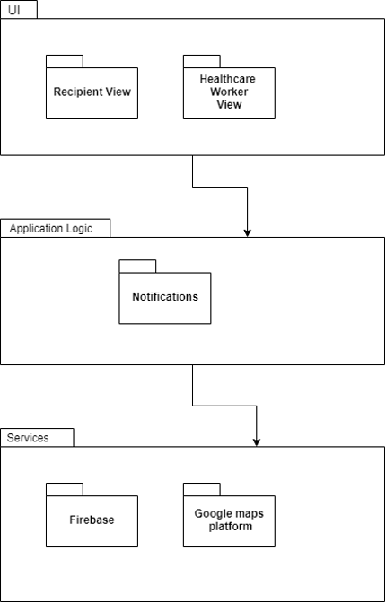

# ConsrVac
A react-native application to notify users of vaccine appointment once registered.  
This program was built at the University of Cape Town.

## Authors
Tshiamo Phaahla | Michelle Lopes | Evashna Pillay

## Mobile View

## Tablet View

## Class Diagram

## System Architecture

